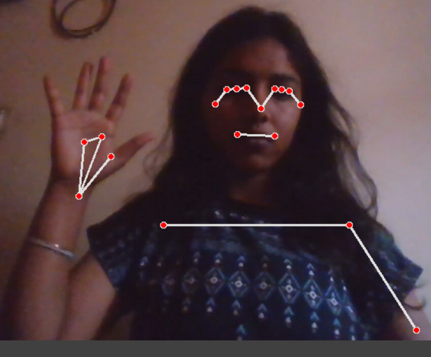

# Human Pose Estimation System

# Description

This project implements a real-time Human Pose Estimation system using computer vision. It detects and tracks human body keypoints from a webcam feed using OpenCV and MediaPipe. The system identifies joints and connections, enabling applications like fitness tracking, posture analysis, and gesture recognition.

# Features

* Real-time human pose detection
* Detects body joints and skeletal structure
* Works with webcam input
* Fast and lightweight implementation
* Easy to run and understand for beginners

# Tech Stack

* Python
* OpenCV
* MediaPipe
* NumPy

# Project Structure

main.py
requirements.txt
demo.png

# Installation

Install the required libraries using:

pip install -r requirements.txt

# Run the Project

Run the following command:

python main.py

#Future improvements 
-Improve accuracy using deep learning models 
-Add multi-person pose detection 
-Integrate with mobile applications 
-Add real-time performance optimization
-use GPU for faster processing 

# Demo

#License

This project is licensed under the MIT License.
