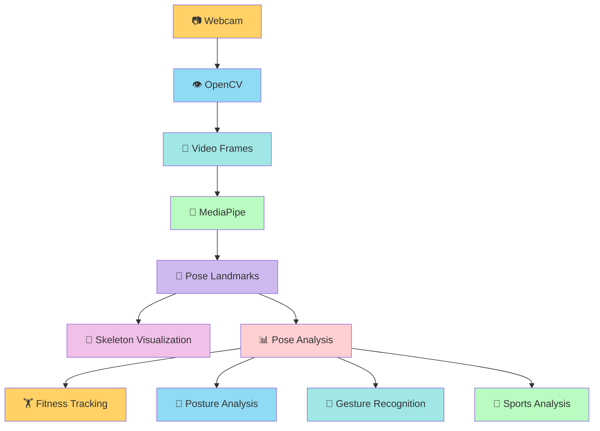
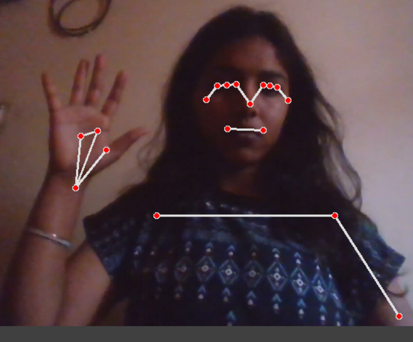

[](LICENSE)

# 🧍‍♀️ Human Pose Estimation System

<p align="center">

### 🎯 See the Human Body in Motion — in Real Time!

**Computer Vision • Pose Detection • Body Tracking • Real-Time Analysis**

<br>


</p>

---

## 🌟 What is this?

> 🧠 **Human Pose Estimation** is a computer vision technique that allows machines to understand the position and movement of the human body.

This project uses **OpenCV + MediaPipe** to detect and track human body landmarks through a webcam in real time.

Instead of simply seeing a person as an image, the system converts the person into a **structured map of body keypoints** such as:

🧠 Head → 🫱 Shoulders → 💪 Elbows → ✋ Wrists → 🫀 Hips → 🦵 Knees → 🦶 Ankles

This creates the foundation for applications such as:

🏋️ Fitness Tracking
🧘 Posture Analysis
🏃 Sports Analysis
🤝 Gesture Recognition
🖥️ Human-Computer Interaction
📊 Movement Monitoring

---

## 👀 What does the system actually do?

```text
                    📷 WEBCAM
                       │
                       ▼
               🎥 VIDEO FRAME
                       │
                       ▼
              🔍 OPENCV PROCESSING
                       │
                       ▼
             🧠 MEDIAPIPE POSE
                       │
                       ▼
              📍 BODY LANDMARKS
                       │
                       ▼
              🦴 SKELETON MAPPING
                       │
                       ▼
             📊 POSE ANALYSIS
                       │
                       ▼
                 ⚡ REAL TIME
```

---

## 🔥 The Core Idea

Imagine the webcam sees this:

```text
        🧠
        │
     🟢───🟢
    /│     │\
   🔵│     │🔵
     │     │
     🟡───🟡
      │   │
     🟠   🟠
```

The system doesn't just see **"a person"**.

It identifies individual **landmarks and connections**:

| 🎯 Landmark  | 🧩 Example            |
| ------------ | --------------------- |
| 🧠 Head      | Face / head position  |
| 🟢 Shoulders | Left & right shoulder |
| 🔵 Elbows    | Arm joints            |
| ✋ Wrists     | Hand positions        |
| 🟡 Hips      | Body center           |
| 🦵 Knees     | Leg joints            |
| 🦶 Ankles    | Foot positions        |

These points can then be used to understand **how the person is moving**.

---

# ⚙️ How It Works


```mermaid
flowchart LR

A["📷 Webcam"] --> B["🎥 Capture Frame"]

B --> C["🔍 OpenCV"]

C --> D["🧠 MediaPipe Pose"]

D --> E["📍 Detect Landmarks"]

E --> F["🦴 Connect Keypoints"]

F --> G["📊 Analyze Pose"]

G --> H["⚡ Real-Time Output"]

style A fill:#FFD166,stroke:#333,stroke-width:2px
style B fill:#90DBF4,stroke:#333,stroke-width:2px
style C fill:#A0E7E5,stroke:#333,stroke-width:2px
style D fill:#B9FBC0,stroke:#333,stroke-width:2px
style E fill:#CFBAF0,stroke:#333,stroke-width:2px
style F fill:#F1C0E8,stroke:#333,stroke-width:2px
style G fill:#FFCFD2,stroke:#333,stroke-width:2px
style H fill:#FFB703,stroke:#333,stroke-width:2px
```

---

# ✨ Key Features

<table>
<tr>
<td width="50%">

### 📷 Real-Time Detection

Detects human poses directly from a webcam feed.

</td>

<td width="50%">

### 📍 Landmark Tracking

Tracks important body joints and keypoints.

</td>
</tr>

<tr>
<td>

### 🦴 Skeleton Visualization

Connects detected landmarks to create a human skeleton structure.

</td>

<td>

### ⚡ Fast Processing

Uses OpenCV and MediaPipe for real-time computer vision processing.

</td>
</tr>

<tr>
<td>

### 🏋️ Fitness Applications

Provides a foundation for exercise and workout tracking.

</td>

<td>

### 🧘 Posture Analysis

Can be extended to detect incorrect body posture.

</td>
</tr>

<tr>
<td>

### 🤝 Gesture Recognition

Body landmarks can be used to recognize gestures.

</td>

<td>

### 📊 Movement Analysis

Pose landmarks can be analyzed to understand human movement.

</td>
</tr>
</table>

---

# 🧠 Technology Stack

<p align="center">

| 🛠️ Technology   | 🎯 Purpose                |
| ---------------- | ------------------------- |
| 🐍 **Python**    | Core programming          |
| 👁️ **OpenCV**   | Image & video processing  |
| 🧠 **MediaPipe** | Pose & landmark detection |
| 📷 **Webcam**    | Real-time video input     |

</p>

---

# 🔬 Pose Estimation Pipeline

The complete computer vision pipeline looks like this:

```text
       RAW VIDEO
           │
           ▼
    ┌──────────────┐
    │    OpenCV    │
    │ Frame Capture│
    └──────┬───────┘
           │
           ▼
    ┌──────────────┐
    │  MediaPipe   │
    │     Pose     │
    └──────┬───────┘
           │
           ▼
    ┌──────────────┐
    │   Landmark   │
    │  Detection   │
    └──────┬───────┘
           │
           ▼
    ┌──────────────┐
    │   Skeleton   │
    │ Visualization│
    └──────┬───────┘
           │
           ▼
    ┌──────────────┐
    │ Pose / Body  │
    │   Analysis   │
    └──────────────┘
```

---

# 🧩 Project Architecture


```mermaid
flowchart TB

CAM["📷 Webcam"] --> CV["👁️ OpenCV"]

CV --> FRAME["🎥 Video Frames"]

FRAME --> MP["🧠 MediaPipe"]

MP --> LAND["📍 Pose Landmarks"]

LAND --> VIS["🦴 Skeleton Visualization"]

LAND --> ANALYSIS["📊 Pose Analysis"]

ANALYSIS --> FITNESS["🏋️ Fitness Tracking"]
ANALYSIS --> POSTURE["🧘 Posture Analysis"]
ANALYSIS --> GESTURE["🤝 Gesture Recognition"]
ANALYSIS --> SPORTS["🏃 Sports Analysis"]

style CAM fill:#FFD166
style CV fill:#90DBF4
style FRAME fill:#A0E7E5
style MP fill:#B9FBC0
style LAND fill:#CFBAF0
style VIS fill:#F1C0E8
style ANALYSIS fill:#FFCFD2
style FITNESS fill:#FFD166
style POSTURE fill:#90DBF4
style GESTURE fill:#A0E7E5
style SPORTS fill:#B9FBC0
```

---

# 🖥️ Demo

> 📸 **Add your project screenshot or GIF here**

Once you have a screenshot/GIF of the webcam detecting your pose, put it inside your repository, for example:

```text
assets/
└── pose-demo.gif
```

Then add:

```markdown
<p align="center">
  
</p>
```

### 🎥 What people should see

```text
┌───────────────────────────────────────────────┐
│                                               │
│             📷 WEBCAM FEED                   │
│                                               │
│                    🟢                         │
│                    │                          │
│              🟢────┼────🟢                    │
│             /      │      \                   │
│           🔵       │       🔵                 │
│                    │                          │
│                 🟡─┴─🟡                       │
│                  /   \                        │
│                🟠     🟠                      │
│                                               │
│          🧠 MediaPipe Pose Detection          │
│                                               │
└───────────────────────────────────────────────┘
```

---

# 🚀 Getting Started

### 1️⃣ Clone the repository

```bash
git clone <YOUR-REPOSITORY-URL>
cd <YOUR-PROJECT-FOLDER>
```

### 2️⃣ Install dependencies

```bash
pip install opencv-python mediapipe
```

### 3️⃣ Run the project

```bash
python main.py
```

📷 Allow webcam access and watch the pose landmarks appear in real time.

---

# 🧪 Example Applications

<details>
<summary>🏋️ Fitness Tracking</summary>

Pose landmarks can be used to track exercises such as:

* Squats
* Push-ups
* Lunges
* Jumping jacks

Future versions can calculate joint angles and count repetitions automatically.

</details>

<details>
<summary>🧘 Posture Analysis</summary>

The detected body landmarks can be analyzed to identify:

* Incorrect sitting posture
* Shoulder alignment
* Back posture
* Head position

</details>

<details>
<summary>🤝 Gesture Recognition</summary>

Body keypoints can be used as input for gesture recognition systems.

This can enable interaction with computers without traditional input devices.

</details>

<details>
<summary>🏃 Sports Analysis</summary>

Pose estimation can provide useful information about:

* Body movement
* Joint positions
* Movement patterns
* Athletic technique

</details>

---

# 🚀 Future Enhancements

The current project is the **foundation** for a much larger AI-powered system.

### 🔮 Planned Features

```text
Current System
      │
      ▼
📍 Pose Detection
      │
      ├──────────────► 💪 Exercise Detection
      │
      ├──────────────► 🔢 Rep Counter
      │
      ├──────────────► 🧘 Posture Correction
      │
      ├──────────────► 🏃 Activity Recognition
      │
      ├──────────────► 📊 Fitness Analytics
      │
      └──────────────► 🤖 AI Movement Classification
```

### 💡 Future Ideas

* 🔢 Automatic exercise repetition counter
* 🧘 Real-time posture correction
* 🏋️ Workout recognition
* 📊 Fitness analytics dashboard
* 🤖 ML-based movement classification
* 🔔 Real-time posture alerts
* 📈 Historical movement tracking
* 🧠 Personalized fitness insights

---

# 📚 What I Learned

Building this project helped me understand several important concepts in **Computer Vision and AI**:

* 🐍 Python programming
* 👁️ Computer Vision fundamentals
* 🎥 Real-time video processing
* 🧠 MediaPipe Pose
* 📍 Landmark detection
* 🦴 Skeleton tracking
* 🔄 Frame-by-frame processing
* 📊 Human movement analysis
* 🤖 Foundations of AI-based activity recognition

---

# 🌍 Real-World Impact

Human Pose Estimation is not just about drawing points on a screen.

The same concept can become the foundation of systems used in:

> 🏥 Healthcare
> 🏋️ Fitness
> 🏃 Sports
> 🎮 Gaming
> 🕺 Motion Capture
> 🤖 Robotics
> 🧑‍💻 Human-Computer Interaction

**One webcam → Body landmarks → Understanding human movement.**

---

# ⭐ Project Highlights

<p align="center">

🧠 **Computer Vision**

  •  

📍 **Pose Estimation**

  •  

⚡ **Real-Time Processing**

  •  

🤖 **AI Applications**

</p>

---

## 💭 Why This Project?

> **"A camera can see a person.
> Pose estimation helps a computer understand how that person is moving."**

This project explores that idea using **Python, OpenCV, and MediaPipe**.

---

<p align="center">

### 🧍‍♀️ Better Movement

### ✨ Healthier You

### 🤖 Smarter Technology

⭐ **If you found this project interesting, consider giving the repository a star!**

</p>


# Demo




#License

This project is licensed under the MIT License.
